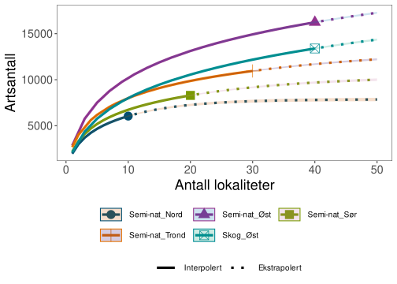

<style>                     
.navbar {
  background-color:#425563;
  border-color:white;
  fg-color:#b4bcc3!important;
}
.navbar-brand {
color:#b4bcc3!important;
font-weight:bold;
}
</style>   

<style type="text/css">

.chart-title { 
   font-size: 15px
   color:#425563

</style>


<!-- Outline: -->
<!-- Hur gör vi i fält -->
<!-- Hur gör vi på lab -->
<!-- Hur gör vi på PCs -->
<!-- Hur ser denna typ av data ut -->
<!-- Tidsserier, Rødlistade arter, Skillnader i  -->
<!-- Artslistor -->
<!-- Finn fångstplats -->
<!-- Innomartsvariation -->


<!-- logo: ./figures/nina_logo_black_48.png -->
<!-- favicon: ./figures/nina_logo_black_48.png -->


```{r}
suppressPackageStartupMessages({
  require(tidyverse)
  require(NinaR)
  require(DBI)
  require(RPostgres)
  require(sf)
  require(Norimon)
  require(knitr)
  require(leaflet)
  require(leaflet.minicharts)
 
 
})
```


```{r}
load("data/shinyPass.Rdata")

connect_to_insect_db(user = my_username,
                     password = my_password)
```

I felt
=====================================

Column {data-width=60%}
-----------------------------------------------------------------------

### Innsamling med Malaise- og vindusfeller

```{r, fig.show="hold"}
include_graphics("figures/felletyper.jpg")

```

### Lokaliteter gjenbesøkes hvert 5 år
```{r forskj }


```


Column {data-width=40%}
-----------------------------------------------------------------------

### Overvåkingsdesign 
Overvåkingen ble startet i 2020 i skog og semi-naturlig mark på Østlandet. I 2021, og 2022 ble semi-naturlig mark lagt til i Trøndelag respektive Sørlandet, og i 2023 skal programmet utvides også til semi-naturlig mark i Nord-Norge. På sikt er ambisjonen å dekke hele landet i begge disse økosystemtyper. 

Vi besøker hver lokalitet i et rullerende skjema der man gjenbesøker fellene etter 5 år. Hvert år besøkes 10 lokaliteter innen hvert økosystem og hver av de 5 landsdelene. Dermed vil programmet på sikt inkludere 250 lokaliteter per økosystem spredt over hele landet.  

Overvåkingen skjer hovedsakelig med malaisefeller, et slags telt der insektene flyver inn og ender opp i en flaske fylt med etanol. På, lokalitetene i skog bruker vi også 4 st vindusfeller, der fremst biller flyger inn i en plastskive og dropper ned i en flaske med etanol. Fellene står ute i den hovedsakelige flyveperioden, fra april til og med oktober, og tømmes annenhver uke. 


### Overvåkingslokaliteter i perioden 2020-2022. {data-width=40%}
```{r}
include_graphics("figures/lokaler20202022-1.svg")

```

På lab
=====================================

Column {data-width=60%}
-----------------------------------------------------------------------

### En malaisefelle samler tusenvis med insekter
```{r}
include_graphics("figures/IMG_8093.jpg")
```

### Eksempel på blomfluer fra en felletømming
```{r}
include_graphics("figures/syrphidae_sortering.jpg")
```


Column {data-width=40%}
-----------------------------------------------------------------------

### Prosessering av prøver
Særskilt malaisefeller fanger store mengder insekter, og en manuell sortering og identifisering av artene ville ta for lang tid i et så stort program som dette. Manuell identifisering stiller også store krav på taksonomisk kompetanse, men er mulig å gjennomføre for enkelte grupper for kvalitetssikring av metodikken, som for eksempel blomsterfluer, .

Felleprøvene prosesseres på lab i Trondheim, der vi tilsetter en "lyserings-væske" som trekker ut DNAet i væsken som deretter "metastrekkodes". Det vil si at man måler forekomst av DNA i væsken fra mange arter samtidig. Deretter tilsettes ny etanol til prøven for den lagres. Insektene er dermed i stor grad intakte for eventuell manuell kontroll etterpå.

### Prøvene veies og DNA-et identifiseres med metastrekkoding
```{r}

```


På PC
=====================================

Column {data-width=60%}
-----------------------------------------------------------------------

### Resultater fra metastrekkoding kvalitetssikres
```{r}

```


### Prosjektet danner store datamengder

Lag flytskjema over datahåndtering


Column {data-width=40%}
-----------------------------------------------------------------------

### Datahåndtering

Lorem markdownum pede abstrahit testes tuum praecluditur iaculum vincere
obscurus, inpulit est finge. Sed pendentia quod. [Phoebo
Latiis](http://pacem.com/cui-saecula) si animam animumque, credunt
[devolvere](http://hoc-per.net/) pollicita laudat, ante quoque crevit monstravit
aevum ultra *veni*.

Temptamenta aquae insidias et impete Piscique relevare in illa, sum *habitu*,
dolore his procul viisque nec. Avem fata sigillis huius. Iuncta concubitus docta
duram: turba cumque qui, est hausit.

- Spolium longa cupit caput arator harenae protecta
- Mariti indignave et amore coniugis
- Tirynthius datque maneas perque rediere pro plenis
- Quies novit fata ille prohibebat pedum rescindere
- Illi qui vertice quis
- Saxo rudem

### Linker til data

https://www.gbif.org/dataset/19fe96b0-0cf3-4a2e-90a5-7c1c19ac94ee


Artsmangfold
=====================================

Column {data-width=60%}
-----------------------------------------------------------------------

### Flere tusen arter observeres ofte, men de aller fleste arter er uvanlige

```{r}
include_graphics("figures/spec-occ-1.svg")
```

### Mer og mer av insektmangfoldet kartlegges
```{r}

```


Column {data-width=40%}
-----------------------------------------------------------------------

### Overvåking av en hyperdivers organismegruppe

Lorem markdownum pede abstrahit testes tuum praecluditur iaculum vincere
obscurus, inpulit est finge. Sed pendentia quod. [Phoebo
Latiis](http://pacem.com/cui-saecula) si animam animumque, credunt
[devolvere](http://hoc-per.net/) pollicita laudat, ante quoque crevit monstravit
aevum ultra *veni*.

Temptamenta aquae insidias et impete Piscique relevare in illa, sum *habitu*,
dolore his procul viisque nec. Avem fata sigillis huius. Iuncta concubitus docta
duram: turba cumque qui, est hausit.

- Spolium longa cupit caput arator harenae protecta
- Mariti indignave et amore coniugis
- Tirynthius datque maneas perque rediere pro plenis
- Quies novit fata ille prohibebat pedum rescindere
- Illi qui vertice quis
- Saxo rudem

### Mange observerte arter har ennå ikke blitt tildelt et navn
```{r}

```


Resultater i et nøtteskall
=====================================

Column {data-width=60%}
-----------------------------------------------------------------------

### Variasjon innen år

```{r}

```

### Rødlistede og "nye" arter 
```{r}

```


Column {data-width=40%}
-----------------------------------------------------------------------

### Starten på en tidsserie

Lorem markdownum pede abstrahit testes tuum praecluditur iaculum vincere
obscurus, inpulit est finge. Sed pendentia quod. [Phoebo
Latiis](http://pacem.com/cui-saecula) si animam animumque, credunt
[devolvere](http://hoc-per.net/) pollicita laudat, ante quoque crevit monstravit
aevum ultra *veni*.

Temptamenta aquae insidias et impete Piscique relevare in illa, sum *habitu*,
dolore his procul viisque nec. Avem fata sigillis huius. Iuncta concubitus docta
duram: turba cumque qui, est hausit.

- Spolium longa cupit caput arator harenae protecta
- Mariti indignave et amore coniugis
- Tirynthius datque maneas perque rediere pro plenis
- Quies novit fata ille prohibebat pedum rescindere
- Illi qui vertice quis
- Saxo rudem

### Artsamfunn varierer med økosystem, og over tid
```{r}

```

Innenarts-variasjon
=====================================

Column {data-width=60%}
-----------------------------------------------------------------------

### Haplotyper

```{r}
 asv_perc_reads <- tbl(con,
                        Id(schema = "views",
                           table = "asv_perc_reads"))
```

```{r}
basemap <- leaflet(width = "100%",
                   height = "400px") %>% 
  addTiles(group = "OpenStreetMap")


asv_to_leaflet <- function(species = "NULL"){

  sel_asv <- asv_perc_reads %>%
  filter(species_latin_gbif == species)  %>%
    collect() %>% 
   #  filter(!!input$species_select_asv %in% (species_latin_gbif)) %>%
  mutate(asv = as_factor(sequence_id),
         perc_reads = round(perc_reads*100, 2))
  
  
  to_plot  <- sel_asv %>% 
  # mutate(lat = st_coordinates(geometry)[,2],
  #        lon = st_coordinates(geometry)[,1]) %>%
  # st_drop_geometry() %>% 
   select(locality, 
         lat,
         lon, 
         sequence_id,
         perc_reads,
         sum_reads) %>% 
  pivot_wider(names_from = "sequence_id",
              values_from = "perc_reads",
              names_prefix = "seq_",
              values_fill = 0)
  
  return(to_plot)
}


# asv_leaflet <- function(species = NULL){
#   
#   to_plot <- asv_to_leaflet(species)
#   
#   basemap %>% 
#    addMinicharts(to_plot$lon,
#                 to_plot$lat,
#                 type = "pie",
#                 chartdata = to_plot[, which(grepl("seq_", names(to_plot)))],
#                 width = log(to_plot$sum_reads) * 2 ,
#                 legend = FALSE,
#                )
#   
#   
# }
```


```{r}
renderLeaflet({
  
   to_plot <- asv_to_leaflet(input$asv_species)
  
  basemap  %>% 
    addMinicharts(to_plot$lon,
                to_plot$lat,
                type = "pie",
                chartdata = to_plot[, which(grepl("seq_", names(to_plot)))],
                width = log(to_plot$sum_reads) * 3 ,
                legend = FALSE,
               )

})


```


Column {data-width=40%}
-----------------------------------------------------------------------

### Utvalg
Velg art, vis identification confidence

```{r}
loc_species_list <- tbl(con,
           Id(schema = "views",
              table = "loc_species_list"))  


species_choices <- loc_species_list %>% 
  select(species_latin_gbif) %>%
  distinct() %>%
  arrange(species_latin_gbif) %>% 
  pull()


selectInput("asv_species",
            label = "Velg Art",
            choices = species_choices,
            selected = "")

```


### Notater
Forklarende tekst her.


